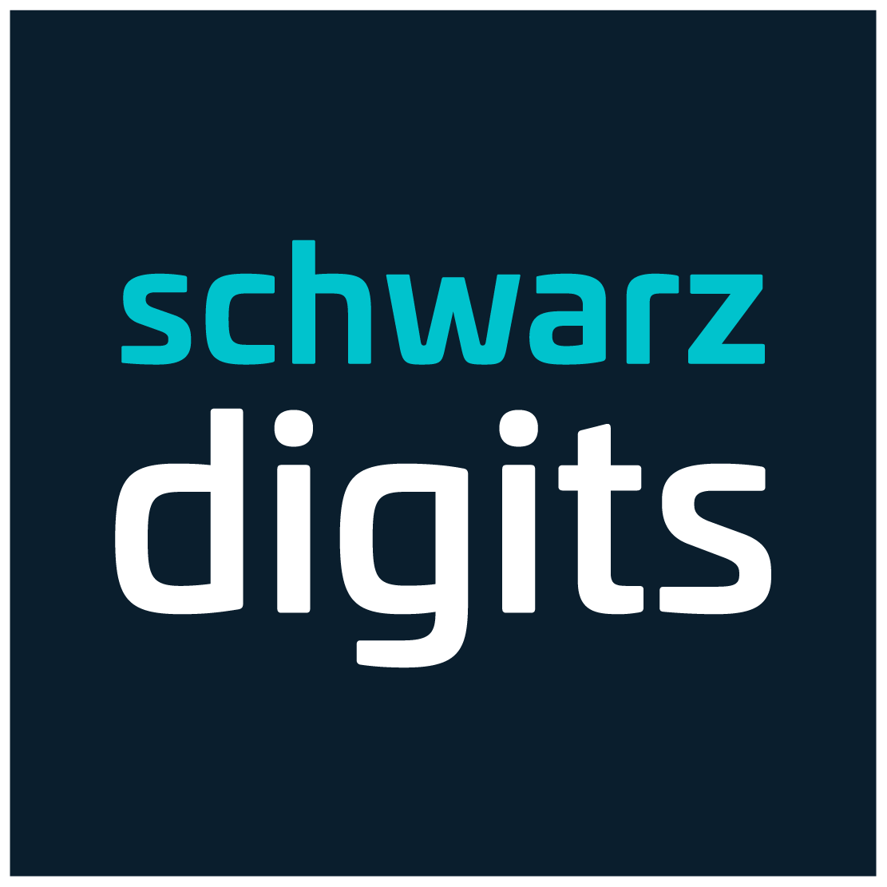

> **Digital Sovereignty for Europe**

As the technology partner for a sovereign digital Europe, we provide Cloud, Cyber Security, Data & AI, Communication, and Workspace solutions serving businesses, the public sector, and society at large.

We unify **8,000 experts** from **Schwarz IT**, **STACKIT**, **XM Cyber**, **Kaufland e-commerce**, **Lidl e-commerce**, **Schwarz Media**, and **mmmake**.

---

### 🏗️ Our GitHub Ecosystem

We are currently consolidating our open source presence under the **Schwarz Digits** brand. While we build up this space, please explore our specialized organizations:

### ☁️ [STACKIT](https://github.com/stackitcloud)
> **The sovereign cloud for Europe.**
> Dive into our cloud ecosystem: This is the home for our official SDKs, Terraform providers, and open source tools to build your digital future.

### 💻 [Schwarz IT](https://github.com/SchwarzIT)
> **The retail powerhouse.**
> Home to our retail solutions and legacy projects.
> *Note: We are gradually migrating selected repositories to the Schwarz Digits umbrella.*

---

### 🚀 Join the Journey
We are building the leading digital ecosystem in Europe.

* **Explore our vision:** [digits.schwarz](https://schwarz-digits.de/en)
* **Join the team:** [Career](https://schwarz-digits.de/en/jobsearch)
